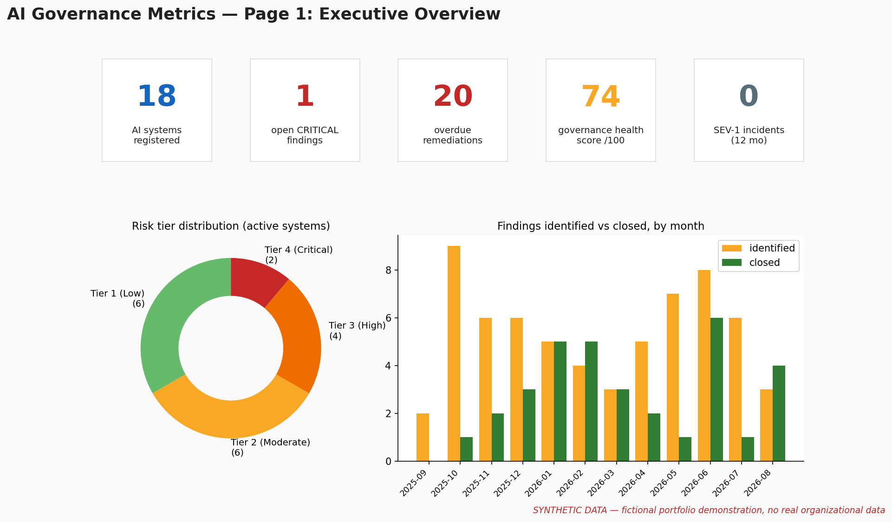
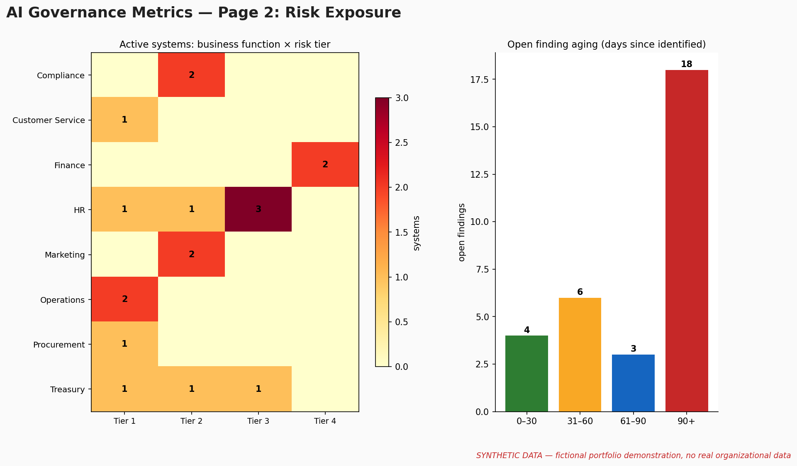
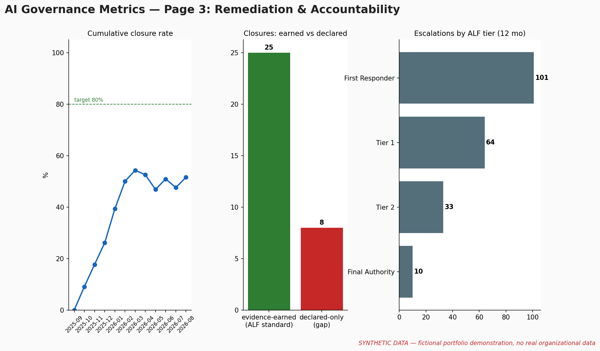
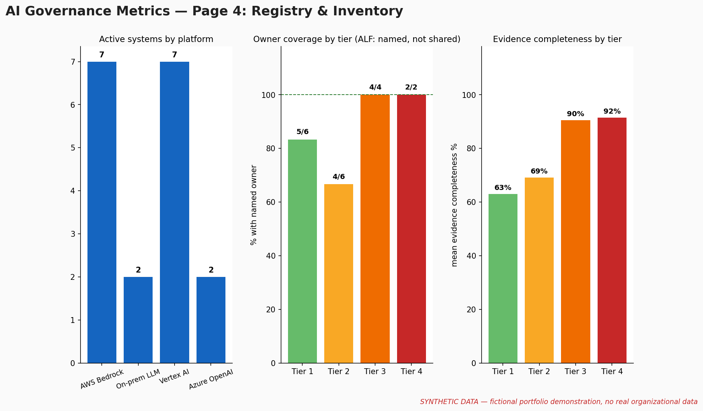

# Grace M. Adjeli — AI Governance Portfolio

**AI Governance & Security Leader | AIGP • CISSP • PMP | AI GRC, Runtime Governance & Accountability Engineering | Author, Execution Governance Model | PhD Candidate**

> **Governance is not what is defined. It is what is enforced at execution.**

I build the part of AI governance that most organizations skip: the enforcement layer between a policy on paper and a system that actually acts on it. Registries, runtime controls, evidence systems, and accountability structures that decide what an AI system is allowed to do, record what it actually did, and make a named person responsible for what happens next.

A policy is not a control. A log is not accountability. A dashboard is not oversight. My work lives in the distinction.

- LinkedIn: https://www.linkedin.com/in/graceadjeli/
- Writing: https://graceadjeli.substack.com/
- Research: https://bridgecore-ai.com/

---

## What I build, and what the proof looks like

Each capability below is backed by complete, working artifacts in my private portfolio repository — frameworks, runnable code, assessments, and evidence systems, all built to an audit standard and clearly labeled synthetic. **The full repository is available to hiring managers, recruiters, and collaborators upon request.**

| Capability | What the full artifact contains |
|---|---|
| AI governance frameworks, policies, and controls | A NIST CSF 2.0 GOVERN operating model built as a public reference implementation: control records, evidence architecture, registers, and review workflows at audit standard |
| Regulatory translation (NIST AI RMF, ISO/IEC 42001, EU AI Act) | Frameworks converted into operational controls and working processes, not policy summaries |
| Runtime governance and enforcement | The Execution Governance Model v3.0: a formally specified runtime governance framework with 6 verified guarantees, 57 adversarial tests, and 21 conformance checks |
| Human oversight, escalation, and accountability | The Accountability Layer Framework v4.0: named ownership, time-bound escalation, and closure that must be earned with evidence |
| Agent inventory, registry, and runtime controls | A working demo: governance gateway mediating every agent action, hash-chained tamper-evident audit log, role-bound human approval gates, and a tested kill switch — 16 adversarial tests, all passing |
| AI incident readiness and response | A full playbook: severity taxonomy, triage flow, ALF-aligned escalation matrix, four communication templates (internal, executive, regulator, customer), and post-incident review standard |
| Use case intake and risk tiering | A complete tool: intake questionnaire with agentic best-fit check, weighted scoring model with hard overrides, and a routing decision tree with worked synthetic cases |
| Audit evidence and assessment rigor | The NIST SP 800-37 lifecycle with CNSSI 1253 control tailoring and hash-chained evidence integrity |
| End-to-end AI governance program execution | A full program case study: charter through ISO/IEC 42001 internal audit with evidence-verified CAPA closure |
| Governance metrics and executive reporting | A four-page executive dashboard on a reproducible synthetic dataset (sample pages below) |
| NIST CSF 2.0 GOVERN assessment execution | A complete 31-subcategory assessment with evidence pack: request log, board documents, and findings where documents outrank stakeholder claims |
| FedRAMP 20x authorization (CSP side) | A full Class C authorization package: system boundary, KSI self-assessment, control narratives, OSCAL excerpts, continuous monitoring, and agency ATO conversion planning |

## Sample: governance metrics dashboard (synthetic data)

| Executive overview | Risk exposure |
|---|---|
|  |  |

| Remediation & accountability | Registry & inventory |
|---|---|
|  |  |

## How I work

- **Evidence over assertion.** Every finding traces to cited evidence; every recommendation addresses a specific, evidenced gap.
- **Stated limitations.** Every reference implementation documents what it does not prove.
- **Synthetic data only.** All public examples are fictional and clearly labeled. No client or employer data, ever.
- **Adversarial verification.** Controls get tested against the failure modes they claim to prevent.

## Background

- More than ten years across technology risk, cybersecurity governance, and program delivery in regulated environments: federal financial institutions, DoD-aligned missions, financial services, and healthcare.
- Certifications: AIGP | CISSP | SSCP | PMP | PMI-ACP | SAFe SPC | SAFe RTE
- PhD candidate at Capitol Technology University, researching ethical frameworks for human-AI collaboration in cybersecurity decision-making.
- Frameworks: NIST AI RMF | ISO/IEC 42001 | EU AI Act | NIST CSF 2.0 | NIST SP 800-53 and 800-37 | FedRAMP 20x | OWASP AI Security

## Access

I am open to AI Governance, AI Risk and Compliance, AI GRC, and AI Governance Program roles.

The full portfolio repository — including all source code, completed assessments, and working artifacts — is available upon request.

**Email:** gracemichaels.adjeli@gmail.com | **LinkedIn:** https://www.linkedin.com/in/graceadjeli/

---

*Governance is not what is defined. It is what is enforced at execution.*
**Grace M. Adjeli**
